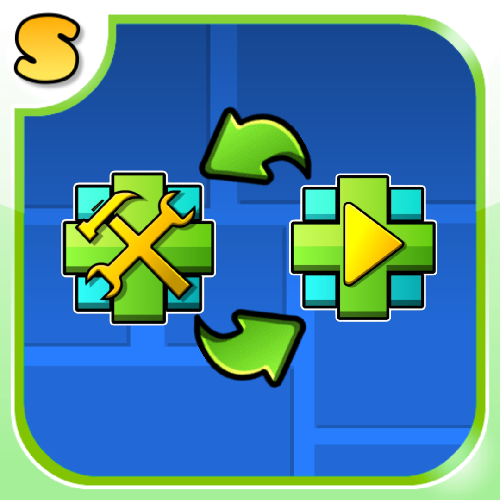

   
   <h1 align="center">Button Swapper Mod</h1>
   

      Geode Mod that swap the editor and the play button in the main menu
   

   

      but is button swapper possible with accurate hitboxes ?
   
   
   

      

         No, a button swapper mod is not impossible with accurate hitboxes. Accurate hitboxes and button swapping affect different layers of a game’s system, and they generally do not prevent each other from existing. A button swapper mod changes how player inputs are mapped to actions, while hitboxes define the geometric areas used by the game engine to detect collisions or interactions. Because these two systems serve different technical purposes, the presence of accurate hitboxes does not inherently prevent a button swapper from functioning.

To understand why, it is important to separate the roles of input handling and collision detection. Input handling is the system responsible for interpreting the signals coming from the player’s device, such as keyboard keys, controller buttons, or touchscreen inputs. When a button is pressed, the game translates that input into an action—for example, jumping, attacking, or interacting with an object. A button swapper mod typically modifies this mapping so that a different button triggers the same action. For instance, the mod might allow the jump action to be activated with another key or controller button instead of the default one.

Hitboxes operate in a completely different part of the game logic. A hitbox is a mathematical representation of an object’s collision boundary, usually defined as a rectangle, circle, or polygon surrounding a game object. The game engine uses these shapes to determine whether objects intersect, touch, or overlap. When a player jumps onto a platform, for example, the engine checks whether the player’s hitbox intersects the platform’s hitbox. This calculation is independent of which button triggered the jump action.

Because of this separation, accurate hitboxes do not prevent the implementation of a button swapper mod. If the mod only changes which button triggers a specific action, the underlying collision system remains unchanged. When the player presses the swapped button, the same jump or interaction command is executed, and the hitbox calculations occur exactly as they would with the original button mapping.

However, there are situations where implementation details can make a button swapper mod more complicated. Some games handle input in ways that are tightly integrated with other systems, especially in heavily optimized engines or games that restrict modification. In such cases, the difficulty comes from how the input system is programmed or protected, not from the accuracy of the hitboxes themselves. For example, if a game stores input mappings in compiled code or verifies game files to prevent modifications, creating a mod that changes button assignments may require deeper access to the code or memory.

Another factor is the design of the modding tools or APIs provided by the developers. If the game exposes configurable input bindings through settings or scripting interfaces, implementing a button swapper is usually straightforward. If the game does not expose such systems, modders may need to intercept input events before the game processes them or modify the internal control logic. Again, this complexity relates to the input architecture rather than to collision detection.

It is also worth noting that accurate hitboxes are generally beneficial to gameplay regardless of input configuration. They ensure that interactions occur precisely when objects visually overlap in the intended way. Whether the player presses one button or another to trigger an action does not change how these collisions are calculated. The collision system simply reacts to the resulting in-game movement or event.

For these reasons, the statement that a button swapper mod is impossible with accurate hitboxes is not supported by how these systems typically function in software design. Accurate hitboxes define how objects interact spatially, while button swapping modifies how player inputs are interpreted. Since these systems operate at different levels of the game architecture, accurate hitboxes do not inherently prevent the creation or functioning of a button swapper mod.
      

      

         *text by ItsMeChatGpt*
      

   

